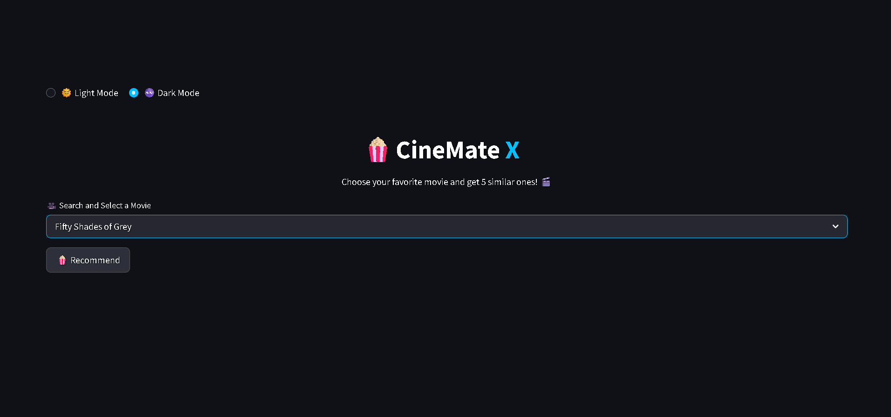
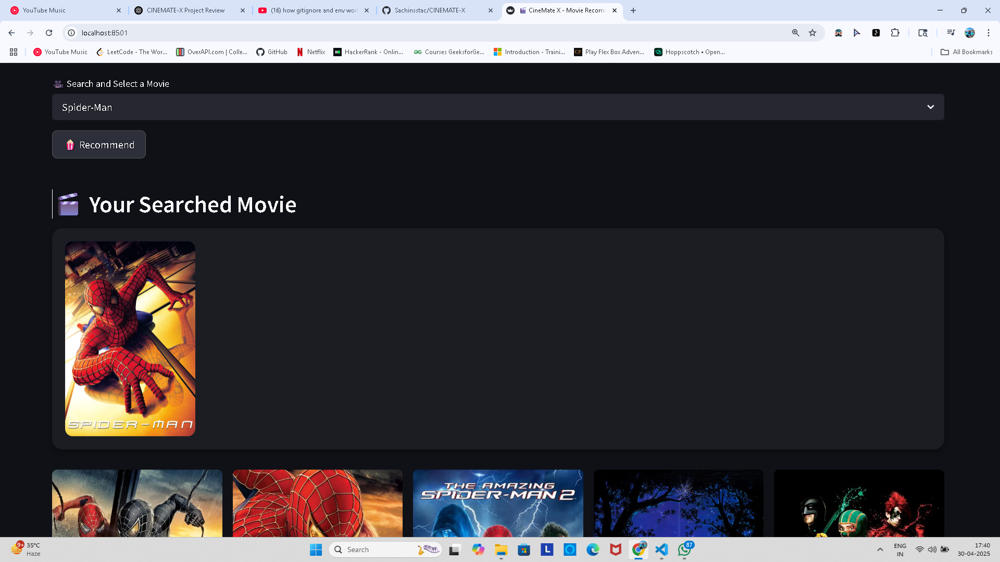
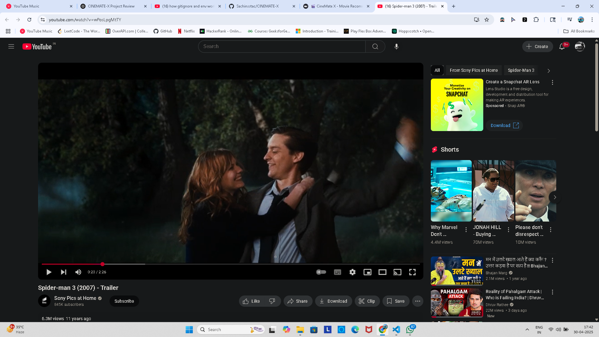

# 🍿 CINEMATE-X 🎥
A Content-Based Movie Recommendation System

**CineMate X** is a sleek, user-friendly movie recommendation system designed to enhance your viewing experience. Leveraging the power of TMDB's API, CINEMATE-X suggests movies based on your preferences, complete with posters, trailers, and detailed information.

Experience **CINEMATE-X live** : [CINEMATE-X Web App](https://cinemate-x-unnsmqjdhd2pylereihyaj.streamlit.app/)

## Features
- Movie recommendation system
- TMDB API integration
- Clean UI with Streamlit

## Tech Stack
Python, Pandas, Streamlit, TMDB API

# Preview in DARK MODE

# Your Searched Movie is appear here.

# You redirect to youtube now you can watch your favorite movie's trailer in just few clicks.

# Made with ❤️ by Sachin

📧 Contact
For feedback, suggestions, or queries, reach out at: 
📩 Email : sachin.962545@gmail.com

